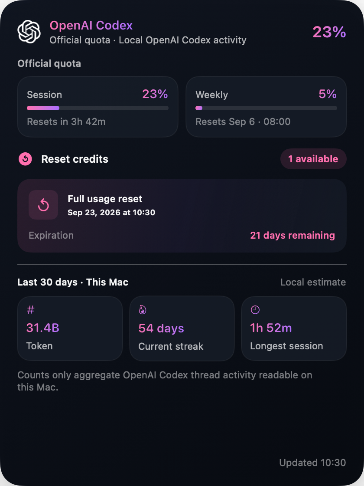
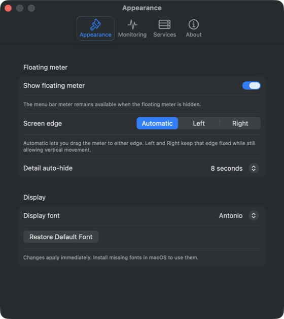

# AI Token Meter


[](https://github.com/sljzdotcom/AI-Token-Meter/actions/workflows/ci.yml)
[](LICENSE)

AI Token Meter 是一款面向 macOS 与 Windows 的本地桌面用量工具，把 Claude Code、OpenAI Codex 和 DeepSeek 的账户使用状态集中到一个轻量的贴边悬浮条中。副标题为 **Private AI usage monitor**。数据留在本机，常用信息一眼可见，详细额度、重置时间、充值券和近 30 天 API 用量则在点击后展开。macOS 使用 SwiftUI/AppKit，Windows 使用 Tauri 2、Rust、React 与 Win32，并通过共享合同保持数据口径一致。

> **English:** A privacy-minded macOS and Windows usage meter for Claude Code, OpenAI Codex, and DeepSeek. Credentials remain with the official CLIs, macOS Keychain, or Windows Credential Manager. Both apps share the same quota semantics and are open source under the MIT License.

> 项目状态：下一个双平台发布候选为 `0.3.0-preview.2`（build `9`）；当前已公开 Preview 仍为 `0.3.0-preview.1`，最新稳定版仍为仅含 macOS 的 `0.2.2`。Windows Preview 尚未完成全部交互式真机验收，安装器也未取得 Authenticode 发布者签名。

## Screenshots

| 贴边浮岛 | OpenAI Codex 详情（Demo 数据） | Appearance Settings |
| --- | --- | --- |
|  |  |  |

## 主要功能

- 原生 macOS 菜单栏 App，无 Electron、无常驻浏览器窗口。
- 菜单栏使用 18×18pt 单色 Quantum Dial：断环进度和指针动态显示三项服务中的最高已用比例，旁边保留精确百分比；无有效数据时显示中性仪表与 `—`。
- 原生 WidgetKit 桌面组件支持 Small、Medium、Large 三种尺寸：Small 仅显示三个 Logo 状态环，Medium 展示三张额度卡，Large 额外展示最近重置与 OpenAI Codex 重置券摘要。
- 贴边浮岛只显示三个经过光学校正的品牌 Logo 与用量环；内部使用低亮度黑蓝「深海波纹」背景，左右贴边时背景会随轮廓镜像，但 Logo 和进度方向保持不变。
- Claude Code、OpenAI Codex、DeepSeek 分别使用黄橙、玫红紫、薄荷紫强调色；警告、严重、缓存和不可用状态仍使用统一语义色。
- 浮岛会按物理显示器稳定标识记住目标屏、侧边和垂直位置；目标屏暂时断开时只临时回到当前主屏，重新接入后自动恢复，详情始终朝桌面内部展开。
- 浮岛保持 macOS 桌面层，普通应用和全屏应用可自然覆盖；用户点击 Provider 后，临时详情会显示在普通应用窗口上方，关闭或自动隐藏后立即退出窗口栈。
- Settings 按 Appearance、Monitoring、Services、About 四个顶部 Tab 分类；新增设置按职责归类，不再堆进单一长页面。
- Services 始终显示 Claude Code、OpenAI Codex、DeepSeek 当前连接状态；Claude Code/OpenAI Codex 可一键打开官方 CLI 登录或重新登录，完成后自动回查。
- OpenAI Codex 可从 Shell PATH、`~/.local/bin`、nvm/常见 Node 管理器或已安装 ChatGPT/Codex App 中自动发现；Finder 启动时也会为 Node 脚本补齐运行 PATH，确实缺失时提供官方安装指南。
- 统一的深色玻璃详情页和无文字仪表指针 App Icon，兼顾浅色、深色与高对比度桌面。
- 浮动条、详情和菜单点击面板的显示字体可在 System Default、Antonio、DIN Condensed、Alimama FangYuanTi VF、Fira Code、Leigo、Menlo、Alimama DaoLiTi 之间即时切换；仅使用本机已安装字体，Settings 永远保持 macOS 系统字体。
- Claude Code：读取当前会话与周额度，并在专用详情页补充本机最近 30 天的会话、活跃日、Token 总量和每日趋势；两种数据口径明确分区。
- OpenAI Codex：读取官方通用速率限制和重置额度，并在详情中补充本机近 30 天 Token、连续使用天数与最长会话。
- DeepSeek：读取账户余额；以可配置余额基准（默认 ¥100）显示已消耗比例。
- DeepSeek 详情页：通过隔离的官方网页会话获取最近 30 天成本、请求数、Token 数和每日成本图表。
- 点击屏幕空白处关闭详情；详情可在 3、5、8、15 或 30 秒后自动收起，悬停、键盘焦点、VoiceOver 与登录操作期间暂停倒计时。
- 每 5 分钟自动刷新，支持手动刷新、离线缓存和 70% / 90% 阈值通知。
- DeepSeek API Key 存入 macOS Keychain；替换时先经官方余额接口验证，失败会保留旧 Key，设置页只显示最后四位遮罩。
- Settings → About 支持手动检查 GitHub 新版本；发现更高稳定版本后，可由用户明确点击更新，Sparkle 会验证 EdDSA 签名后替换 App 并重新启动。应用不会在后台检查，也不会静默安装。

## 数据来源一览

| 服务 | 数据来源 | 主要显示内容 | 首次准备 |
| --- | --- | --- | --- |
| Claude Code | 已登录的 Claude Code CLI，隔离工作区内执行 `/usage`；Windows 本机活动跟随所选 Native/WSL profile | 当前会话、周额度、重置时间、近 30 天本机活动 | 安装并登录 Claude Code；首次可能需批准 AI Token Meter 私有工作区 |
| OpenAI Codex | OpenAI Codex CLI 官方 `app-server` JSON-RPC + 当前 Native/WSL profile 状态库的允许聚合列 | 通用用量窗口、重置额度、近 30 天本机活动 | 安装并登录 OpenAI Codex CLI |
| DeepSeek | 官方余额 API + App 内隔离的 `platform.deepseek.com` WebKit 会话 | 余额、基准消耗环、近 30 天成本/请求/Token 图表 | 在设置中保存 API Key；历史图表首次需登录官网 |

详细的数据口径、降级行为与限制见 [服务与指标说明](docs/user-guide/providers.md)。

## 系统要求

### macOS

- Apple Silicon Mac（M1 或更新机型）。
- macOS 14 Sonoma 或更新版本。
- 从源码构建时需要 Xcode Command Line Tools 与 Swift 6 工具链。
- 桌面 Widget 需要在 Xcode 登录 Apple Account 并具备有效的 Apple Development 证书；没有证书时仍可构建普通主应用。
- Claude Code 与 OpenAI Codex 是可选服务；需要监控哪项服务，就安装并登录对应 CLI。
- DeepSeek 是可选服务；余额需要 API Key，30 天用量图表需要在 App 的隔离网页中登录 DeepSeek 平台。

### Windows

- Windows 11 x64；需要 Microsoft Edge WebView2 Runtime（安装器可引导下载）。
- Claude Code 与 OpenAI Codex 可使用 Windows 原生安装，也可从 WSL 发行版发现；应用明确显示实际来源和 CLI 版本。
- DeepSeek API Key 保存在当前 Windows 用户的 Credential Manager；30 天历史使用应用独立的 WebView2 用户数据目录。
- Windows Widget 不在首个 Preview 范围内。当前无 Authenticode 证书，Preview 安装器可能出现 SmartScreen 提示；只应从本项目 GitHub Release 下载并核对 SHA-256。

## 下载与安装

发布候选标识：`Download v0.3.0-preview.2`。该版本尚未公开，因此此处暂不提供虚假下载链接；正式 Release 与公网资产复验完成后再替换下面的当前公开入口。

**[Download v0.3.0-preview.1](https://github.com/sljzdotcom/AI-Token-Meter/releases/tag/v0.3.0-preview.1)** from GitHub Releases：

- macOS：下载 `AI-Token-Meter-0.3.0-preview.1-macOS-arm64.zip` 与同名 `.sha256`；
- Windows：下载 `AI-Token-Meter-0.3.0-preview.1-windows-x64-setup.exe` 与同名 `.sha256`。

预览版用于提前验证 Windows 与双平台同步发布。需要稳定版时仍可使用 [v0.2.2](https://github.com/sljzdotcom/AI-Token-Meter/releases/tag/v0.2.2) 的 macOS 包。Windows Preview 安装器未取得 Authenticode 签名，Microsoft Defender SmartScreen 可能显示 unknown publisher；请只从本仓库 Release 下载并核对 SHA-256。应用内 Windows 更新另由 Tauri minisign 签名验证保护。

1. 完全退出已有的 AI Token Meter。
2. 解压 ZIP，并把 `AI Token Meter.app` 移到 `/Applications`。
3. 当前公开包是 **ad-hoc signed** 且 **not notarized**；首次打开若被 macOS 阻止，请在 Finder 中右键 App 并选择“打开”。
4. 在 Settings → Services 配置需要使用的 Provider；所有 Provider 都是可选的。

macOS 包支持 Apple Silicon 与 macOS 14+，不包含需要 Apple Development 证书的 Widget；Windows 包支持 Windows 11 x64。详细步骤和 SHA-256 校验方法见[安装与首次使用](docs/user-guide/getting-started.md)。

`0.1.2` 尚未包含应用内更新器，因此需要手动安装一次当前版本。从 `0.2.0` 开始，可在 Settings → About 点击 **Check for Updates**，发现新版后再点击 **Update Now**；只有这两个用户动作会触发联网和安装。

## 从源码安装

### macOS

```bash
git clone https://github.com/sljzdotcom/AI-Token-Meter.git
cd AI-Token-Meter
bash scripts/build-app.sh
open "dist/AI Token Meter.app"
```

默认 `auto` 模式会检测 Apple Development 签名：证书与 Team ID 可用时嵌入 Widget，否则明确显示 `Widget skipped` 并生成普通主应用。要强制构建 Widget，可使用：

```bash
AI_METER_INCLUDE_WIDGET=1 bash scripts/build-app.sh
```

构建脚本会生成完整尺寸的仪表指针 App Icon、组装 `dist/AI Token Meter.app`、嵌入 Sparkle framework 与更新 helper，并验证运行路径和嵌套签名。无 Widget 产物使用 ad-hoc 本机签名；Widget 产物要求真实 Apple Development 签名与双方一致的 App Group。当前产物面向 Apple Silicon 本机使用，不是经过 Developer ID 签名和 Apple 公证的公开发行包。

日常使用时，退出 AI Token Meter 后把应用移到 `/Applications`，再从“应用程序”启动。如果移动了应用路径，请重新开关一次“登录时启动”。

完整步骤见 [安装与首次使用](docs/user-guide/getting-started.md)。

### Windows 11 x64

```powershell
git clone https://github.com/sljzdotcom/AI-Token-Meter.git
cd AI-Token-Meter\windows
npm ci
npm test
npm run tauri build
```

需要 Node.js 24、Rust 1.88 与 Microsoft C++ Build Tools。生成的 current-user NSIS 位于 `windows\src-tauri\target\release\bundle\nsis\`。普通源码构建不需要更新私钥；只有维护者发布流程会启用 `tauri.release.conf.json` 生成签名更新归档。

## 第一次使用

1. 启动 AI Token Meter。屏幕右侧出现贴边浮岛和三个用量环；macOS 使用菜单栏图标，Windows 使用系统托盘图标。
2. 从菜单栏或系统托盘打开 Settings；macOS 也可以按 `⌘,`。
3. 在 Services 查看 Claude Code 与 OpenAI Codex 当前账户；需要登录或换账号时点击 **Sign in** / **Sign in again**，在打开的官方终端流程中完成登录。如 Claude Code 提示工作区设置，再点击 **Authorize Usage Workspace** 并批准。
4. 如需 DeepSeek，在 Services 选择 **Replace API Key**。macOS 使用受保护输入，Windows 打开系统 Credential UI；应用验证成功后才写入 Keychain/Credential Manager，Key 不进入 Windows WebView。把“Balance baseline”设为希望参考的余额（默认 ¥100）。
5. 点击 DeepSeek 圆环，在详情页登录官方平台以启用近 30 天用量图表。
6. 按需开启 70% / 90% 提醒、登录时启动，选择详情自动隐藏时间、浮岛侧边模式和显示字体。Windows 还可分别为 Claude Code/OpenAI Codex 选择 Automatic、Native Windows、WSL 发行版或自定义 CLI 路径。
7. 若构建产物包含 Widget：在桌面空白处右键选择“编辑小组件”，搜索 **AI Token Meter**，添加 Small、Medium 或 Large；点击任意尺寸只会唤醒主应用。

Antonio 与 DIN Condensed 必须先安装到 macOS 才能选择；AI Token Meter 不下载、内置或分发字体文件。缺失字体的选项会禁用，已保存字体临时不可用时会安全回退到 System Default。详见[设置参考](docs/user-guide/settings.md#display-font)。

## 如何理解圆环

- **Claude Code / OpenAI Codex**：圆环表示官方额度已经使用的比例，越接近一整圈，剩余额度越少。
- **DeepSeek**：圆环表示参考余额已经消耗的比例。基准为 ¥100、余额为 ¥77.99 时，圆环约为 `22.01%`。
- 圆环中的 Logo 只表示服务；百分比、余额、重置时间和明细在点击后的详情中显示。
- 菜单栏 Quantum Dial 的弧长、指针与旁边百分比采用同一个最高有效使用比例；余额金额本身不直接触发额度提醒。

## 项目结构

```text
AI-Meter/
├── VERSION                     # macOS/Windows 共享版本
├── contracts/                  # 跨平台 Schema、fixture、展示与功能对等合同
├── Sources/
│   ├── AIMeterApp/              # SwiftUI App、系统集成与界面
│   ├── AIMeterCore/             # 采集、领域模型、缓存、安全与协调逻辑
│   └── AIMeterWidgetExtension/  # WidgetKit 时间线与三尺寸界面
├── Tests/
│   ├── AIMeterCoreTests/        # 领域、解析器、协调与真实 CLI 冒烟测试
│   ├── AIMeterAppTests/         # 浮岛输入、启动、打包和 AppKit/SwiftUI 边界测试
│   └── AIMeterWidgetExtensionTests/ # Widget 布局、时间线和安全合同
├── windows/                    # Tauri 2 + Rust + React + Win32 Windows 应用
├── docs/
│   ├── user-guide/              # 安装、服务配置、设置和排障
│   ├── architecture/            # 架构与源码目录说明
│   ├── development/             # 开发、测试、发布和逐日开发日志
│   └── design/                  # 历史设计规格与实施计划
├── scripts/                     # 测试、Release 构建、Sparkle 打包、签名与安全门禁
├── appcast.xml                  # 稳定版 Sparkle 更新清单
├── CHANGELOG.md                 # 面向版本的变更记录
├── CONTRIBUTING.md              # 贡献规范
└── SECURITY.md                  # 安全问题报告方式
```

完整目录职责见 [代码库结构](docs/architecture/repository-structure.md)。

## 开发与验证

```bash
bash scripts/test.sh
bash scripts/build-app.sh
codesign --verify --deep --strict "dist/AI Token Meter.app"
```

普通测试不会主动读取本机账户状态。真实 CLI 冒烟测试必须显式开启对应环境变量，具体方法见 [测试指南](docs/development/testing.md)。

## 文档

- [文档总览](docs/README.md)
- [当前项目状态](docs/project-status.md)
- [待完成需求与需求历史](docs/requirements-backlog.md)
- [安装与首次使用](docs/user-guide/getting-started.md)
- [服务与指标说明](docs/user-guide/providers.md)
- [设置参考](docs/user-guide/settings.md)
- [故障排查](docs/user-guide/troubleshooting.md)
- [架构概览](docs/architecture/overview.md)
- [架构决策记录](docs/architecture/decisions.md)
- [代码库结构](docs/architecture/repository-structure.md)
- [隐私与安全](docs/security-and-privacy.md)
- [开发环境](docs/development/setup.md)
- [测试指南](docs/development/testing.md)
- [发布流程](docs/development/release-process.md)
- [维护手册](docs/development/maintenance-playbook.md)
- [提交历史](docs/development/commit-history.md)
- [开发日志](docs/development/README.md)
- [2026-09-02 全项目复盘](docs/development/2026-09-02-project-retrospective.md)
- [0.1.1 跨 Mac 资源崩溃修复与分发包](docs/development/2026-09-02-portable-resource-crash-fix.md)
- [0.1.2 Codex nvm 跨 Mac 发现修复与分发包](docs/development/2026-09-02-codex-cli-discovery.md)
- [版本变更](CHANGELOG.md)
- [贡献指南](CONTRIBUTING.md)

## 隐私与安全摘要

- Claude Code 与 OpenAI Codex 凭证由各自 CLI 管理，AI Token Meter 不读取或保存它们的凭证文件。
- Services 中的 Claude Code/OpenAI Codex 邮箱、套餐和 DeepSeek Key 后四位只存在内存，不进入缓存、Widget、通知或登录脚本。
- OpenAI Codex 本机活动只读取线程表中的 Token 数与创建/更新时间，不读取标题、预览、提示词或回复。
- DeepSeek API Key 使用 `AfterFirstUnlockThisDeviceOnly` 级别保存在 macOS Keychain，不随 iCloud Keychain 同步。
- Windows 版 DeepSeek API Key 保存在 Windows Credential Manager；候选 Key 先通过官方余额 API 验证，成功后才替换旧项。
- DeepSeek 历史用量使用 App 自己的隔离 WebKit 会话，不读取 Safari、Chrome 或其他浏览器 Cookie。
- 历史页面的原始响应不会进入业务缓存；AI Token Meter 只保存标准化后的逐日成本、请求数和 Token 总数。
- Widget 只读取主应用写入 App Group 的脱敏展示快照，不联网、不运行 CLI、不读取 Keychain，也不能登录或兑换重置券。
- 缓存、状态消息与通知会先经过敏感文本清理。
- 更新 ZIP 由 Sparkle EdDSA 签名；生产私钥只保存在维护者的 macOS Keychain，不进入仓库、日志或 Release。应用只包含公开验证键，签名不匹配时保持现有版本不变。
- Windows Updater 使用 Tauri minisign 公钥验证 NSIS `setup.exe` 及其 `.exe.sig`；GitHub Actions 私钥仅通过仓库 Secret 注入。当前无 Authenticode，SmartScreen 发布者身份提示与更新内容签名是两个不同边界。

完整说明见 [隐私与安全](docs/security-and-privacy.md)。发现安全问题请按 [SECURITY.md](SECURITY.md) 私下报告。

## 版本与许可

- 下一个双平台发布候选：`0.3.0-preview.2`（build `9`）；当前已公开 Preview：`0.3.0-preview.1`（build `8`）；最新稳定版本：`0.2.2`（build `6`，仅 macOS）。
- 完整变更：见 [CHANGELOG.md](CHANGELOG.md)。
- Git 关键节点：见 [提交历史](docs/development/commit-history.md)。
- **Author: Miller**
- 本项目使用 [MIT License](LICENSE)，允许在保留版权与许可声明的前提下使用、修改和再分发。
